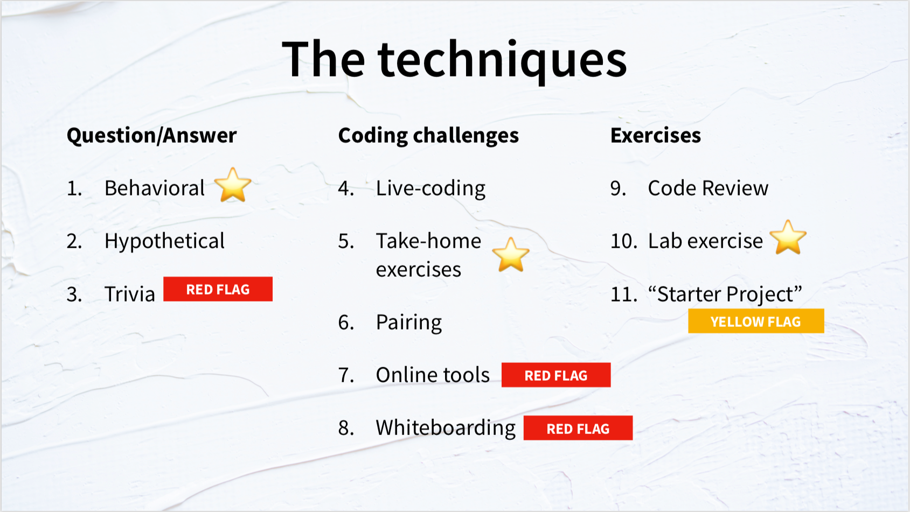

---?image=assets/img/pencils.jpg
@title[Sidebar Templates]

## @color[black](How to Ace a Technical Interview)

@snap[south span-100]
Presented by Jacob Kaplan-Moss 
PyCon APAC 2019
@snapend

---?image=assets/img/blue.jpg&position=left&size=30% 100%
@title[Sidebar + Heading]

@snap[west left text-white]
What He Covered
@snapend

@snap[midpoint covered span-70]
@ul
- Orientation and Overview
- General Advice
- Technical Interview Techniques
@ulend
@snapend

---?image=assets/img/orange.jpg&position=left&size=30% 100%
@title[Sidebar + Image Body]

@snap[west left text-white]
Orientation and Overview
@snapend

@snap[midpoint span-70]
IG's Hiring Funnel:  

@ul
- Source
- CCAT
- Technical Exam
- Technical Interview
- Karat Exam
- Selection
@ulend

@snapend

---?image=assets/img/green.jpg&position=left&size=30% 100%
@title[Sidebar + Mixed Body]

@snap[west left text-white]
General Advice
@snapend

@snap[midpoint span-70]
@ul
- Prepare
- Ask Questions
- Take Notes
@ulend
@snapend

---?image=assets/img/blue.jpg&position=left&size=30% 100%
@title[Sidebar + Text Body]

@snap[west left text-white]
Technical Interview Techniques
@snapend

@snap[east span-70]

@snapend

+++?image=assets/img/blue.jpg&position=left&size=30% 100%

@snap[west left text-white]
Behavioral
@snapend

@snap[east span-70]
“Past performance predicts future behavior.”
@snapend

+++?image=assets/img/blue.jpg&position=left&size=30% 100%

@snap[west left text-white]
Behavioral
@snapend

@snap[east span-70]
Problem Solving 
Refactoring 
Debugging
@snapend

+++?image=assets/img/blue.jpg&position=left&size=30% 100%

@snap[west left text-white]
Live Coding
@snapend

@snap[east span-70]
“The best way to predict if someone can code is… to ask them to code.”
@snapend

+++?image=assets/img/blue.jpg&position=left&size=30% 100%

@snap[west left text-white]
Take-Home Exercises
@snapend

@snap[east span-70]
“We will see more realistic results if we give people more realistic conditions.”
@snapend

---?image=assets/img/orange.jpg&position=left&size=30% 100%
@title[Sidebar + Heading]

@snap[west left text-white]
Notes
@snapend

@snap[midpoint covered span-70]
@ul
- Everyone makes mistakes, but not all the time
- Honesty is important
- Interaction matters
- Giving feedback helps
@ulend
@snapend

---?image=assets/img/pencils.jpg
@title[Sidebar + Heading]

# "Companies mostly suck at hiring"

---?image=assets/img/pencils.jpg
@title[Sidebar + Heading]

# "Companies mostly suck at hiring but not ImportGenius"